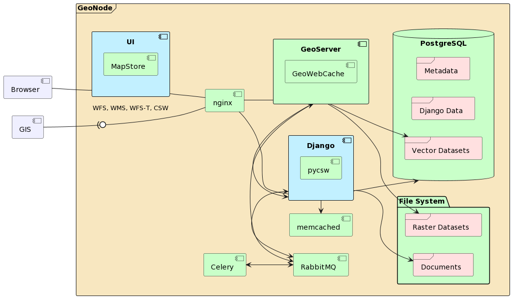

# Geonode Installation

This document will guide you through the installation of [GeoNode](https://geonode.org/), a spatial content management system.
The needed components are available as [Docker](https://www.docker.com/) images and will be set up and run via the [docker compose](https://docs.docker.com/compose/) tool.

## Background

This blueprint is an opnionated GeoNode setup which evolved from several upstream discussions[^1][^2]. The main goal of this blueprint is to have a simplified view on the GeoNode actual setup with less cluttered configuration while preserving flexibility. At the time of writing GeoNode setup is much convoluted at several places so one have to watch out making changes to the defaults (lots of things have side effects). However, the blueprint cannot solve the upstream issues, but tries to narrow the focus on the most important parts. 

We tend to establish a better maintainable project setup[^2][^3] than [the official geonode-project](https://github.com/GeoNode/geonode-project) offers at the moment. Additionally, we added a development setup [using `devcontainer`](https://containers.dev/) configuration [for the Thuenen Atlas](https://github.com/Thuenen-GeoNode-Development/thuenen_atlas), which integrates nicely with IDEs [like vs-code](https://code.visualstudio.com/docs/devcontainers/containers).

Feel free to test and report any findings like bugs, issues, and even conceptual things. We hope, the setup turns to be helpful for other projects and are eager to further improve the setup based on your requirements. In any case the blueprint may give you a good starting point to create you own setup.

[^1]: https://github.com/GeoNode/geonode-project/issues/471
[^2]: https://github.com/GeoNode/geonode-project/discussions/460
[^3]: https://lists.osgeo.org/pipermail/geonode-devel/2023-August/003335.html

## Component Overview

Here is a short overview of the installed components and how they are connected.



The components are:

- **Django:** The actual GeoNode component.
It exposes a [pyCSW API](https://pycsw.org/) and the GeoNode API.
- **Celery:** [Celery](https://docs.celeryq.dev/en/stable/) forms the asynchronuous task queue of GeoNode.
- **GeoServer:** [GeoServer](https://geoserver.org/) is the backend server of GeoNode for sharing geospatial data.
It exposes OGC APIs such as WMS, WFS, etc. 
- **Nginx:** [Nginx](https://nginx.com) serves as advanced load balancer, web server and reverse proxy to all GeoNode components.
- **PostgreSQL:** GeoNode and GeoServer are using [PostgreSQL](https://www.postgresql.org)  with the geospatial extension [PostGIS](https://postgis.net) as the database.

## Setup Project

Make sure you have installed `git`, `Docker` and `docker compose`.

Clone the [repository containing a GeoNode Docker setup]( https://github.com/GeoNodeUserGroup-DE/geonode-blueprint-docker) and change directory your local working copy:

```
git clone --recurse-submodules https://github.com/GeoNodeUserGroup-DE/geonode-blueprint-docker geonode
cd geonode
```

## Configuration

> :bulb: **Note**
>
> Settings (e.g. geodatabase parameters) are mainly configured in the `.env` file. 
> To review in-built default settings of an image, run the `env` command on an image.
> For example `docker run geonode/geoserver env | sort`.
>
> For a complete set of available options take the [GeoNode Settings](https://docs.geonode.org/en/master/basic/settings/index.html#settings) documentation as a reference.

The containers get configured during creation via environment variables. 
The `geonode/settings.py` settings module takes further configuration of the GeoNode containers (`django` and `celery`) and aligns some names with those documented.


Copy the `sample.env` to `.env` and make your changes (`.env` is not versioned).
For a quick start taking default values you can run `docker compose up -d --env-file=sample.env`.


Have a look at the [Ways to set environment variables in Compose](https://docs.docker.com/compose/environment-variables/set-environment-variables/) documentation.


### TLS Config

If you want to configure a TLS certificate, you can mount key and cert as `pem`s in the `geonode` service within the `docker-compose.yml` file.
Uncomment the corresponding lines:

 ```sh
 volumes:
    - nginx-confd:/etc/nginx
    - statics:/mnt/volumes/statics
    # Link to a custom certificate here
    #- <path-to-cert>.pem:/geonode-certificates/autoissued/fullchain.pem
    #- <path-to-key>.pem:/geonode-certificates/autoissued/privkey.pem
 ```


### Volume Configuration

By default compose creates [named volumes](https://docs.docker.com/reference/compose-file/volumes/) on its first start (or in case you stopped using the `-v` flag).
The default volume [configuration is included](https://docs.docker.com/compose/how-tos/multiple-compose-files/include/) from `./compose-volumes_default.yml`.
Configure a different volume setup in a dedicated file, e.g. `./compose-volumes_myconfig.yml`, for example a custom path for each named volume:

```yml
geoserver-data-dir:
  name: ${COMPOSE_PROJECT_NAME}-gsdatadir
  driver_opts:
    device: /mnt/geonode-volume/geoserver_data
    type: none
    o: bind
```

You have to put all volume definitions in `/compose-volumes_myconfig.yml`.
Define `VOLUME=myconfig` as an environment variable and verify your setup via `docker compose config | less`. 

If everything looks good start up the services.


## Start and Run

### Docker-Compose Basics

Run `docker compose up -d` to start all geonode components.
Review all started components by executing `docker compose ps`. 
You can follow logs via `docker compose logs -f` and optionally pass a service to only follow a service's log.

Stop all components via `docker compose down`, and pass a `-v` flag to clean up all volumes (CAUTION: removes all persisted data).

For more features and available commands, `docker compose --help`, or read [the docker compose CLI documentation](https://docs.docker.com/compose/reference/).

### Add a Service Unit

When running GeoNode on a systemd-based Linux, you may want to add a service unit:

/etc/systemd/system/geonode.service
```sh
[Unit]
Description=GeoNode Docker Installation

[Service]
Type=oneshot
ExecStart=docker compose up -d /path/to/workingcopy

[Install]
WantedBy=multi-user.target
```

Then reload the systemd daemon:

```sh
systemctl daemon-reload
```

And enable GeoNode start on each boot:

```sh
systemctl enable geonode.service
```

Check the service status:

```sh
systemctl status geonode.service
```
