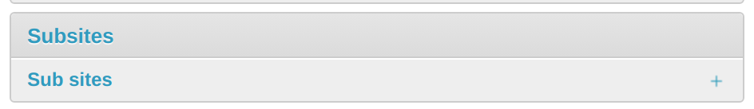
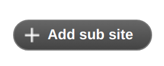
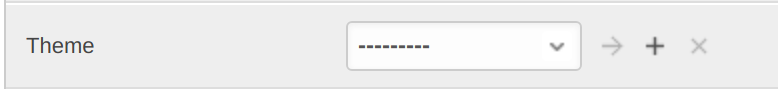
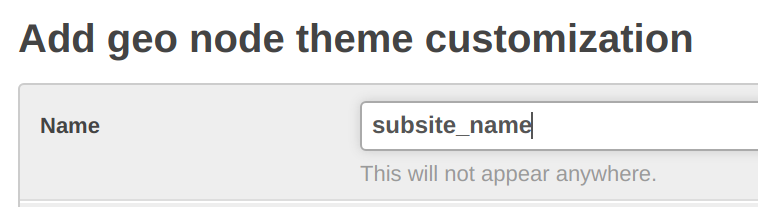
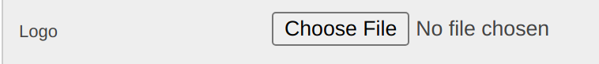
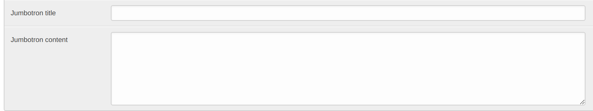
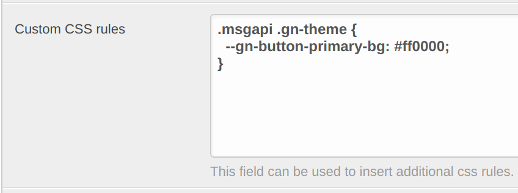
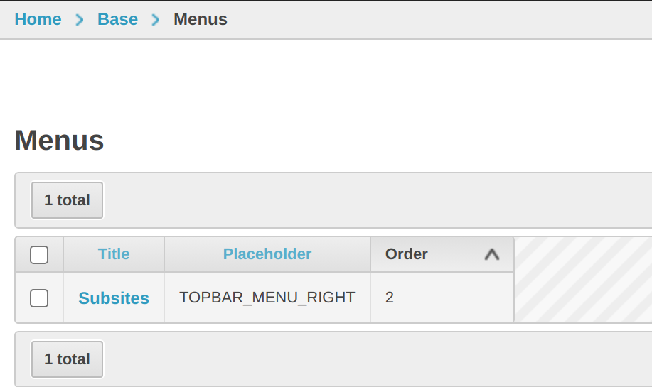

# Subsite Configuration

The following instructions gives guidance on adding a subsite.
For detailed documentation about subsites consult the [official subsite documentation](https://docs.geonode.org/en/4.2.5/advanced/contrib/subsites/index.html) of the [geonode-subsites module](https://github.com/geosolutions-it/geonode-subsites).
Customization on GeoNode themes are described in the [official GeoNode documentation](https://docs.geonode.org/en/master/basic/theme/index.html).

## General Information

Subsites work via `ContextProcessor` which loads filtered datasets when certain URL routes are navigated.
These routes can be created via `Subsites` entry in the Django Admin and are stored in the database, optionally with a customized theme.
Similar to entries of a database model, you can create fixtures from it to re-load subsites into a new database.

## Load Prepared Subsites

This project ships an example subsite configuration and provides fixtures for a subsite with a custom theme. In a terminal, run `python manage.py loaddata fixtures/subsite_red.json`.

However, fixtures are a bit brittle to maintain over time.
So use with care.
Alternatively, use backup/restore once subsites are created. 

Follow the next steps to create a subsite manually.

## Manually Add a New Subsite

In order to add a new subsite *my_subsite*:

1. Add a folder at `templates/subsites/my_subsite/`
2. Create folders `my_subsite/templates/geonode-mapstore-client/snippets`
3. For extending the base template file, add `snippets/custom_theme.html` (see theming guide linked above for details) or ovewrite individual section templates like `brand_navbar.html`, `footer.html` etc.
4. In order for the subsite custom theming to take effect, it needs to be configured through Django admin panel at `http://{host}/admin`

5. In the panel navigate to the subsite section at `http://{host}/admin/subsites/` and add a new subsite

6. Site name has to be *my_subsite* (just as the folder name). 

7. Within the subsite settings, add a theme (any name)

8. Subsite should now be available at `http://{host}/my_subsite/`

## Overridable or Inherit From Snippets

The full list of snippets that could be overridden is as following:
- `brand_navbar.html`
- `custom_theme.html`
- `footer.html`
- `header.html`
- `hero.html`
- `language_selector.html`
- `loader_style.html`
- `loader.html`
- `menu_item.html`
- `search_bar.html`
- `topbar.html`

The [original templates](https://github.com/GeoNode/geonode-mapstore-client/tree/master/geonode_mapstore_client/templates/geonode-mapstore-client/snippets) can be reviewed at `geonode-mapstore-client/geonode_mapstore_client/templates/geonode-mapstore-client/snippets`.

# Subsites in the Admin Panel 

Customize subsites via admin panel at `http://{host}/admin`.
In the SubSite settings, the subentry `Theme` gives you options to change

- the main logo (Field `Logo`)

    

- the title of the page (Field `Jumbotron title`)
- the subtitle of the page (Field `Jumbotron content`)

    

- styling via custom rules (Field `Custom CSS rules`)

    The field "Custom CSS rules" overrides custom styles (`custom_theme.html`) defined for [the default `:root` selector](https://developer.mozilla.org/en-US/docs/Web/CSS/:root).
    Styling can be overridden by using the more concrete `.msgapi .gn-theme` css selector as shown with the following:

    

# Navigating between Subsites

Follow these steps to configure navigation between subsites which are already available:

1. In the admin panel, go to `Menus`.
   Add a new menu, set Title to `Subsites`, Placeholder to `TOPBAR_MENU_RIGHT`, Order to `2`.

    

2. In the admin panel, go to `Menu items`.
    Add two items. 
    First with a title `Parent Site`, menu specified to be `Subsites`, order `1` and URL to be `/`, leave `blank target` checkbox blank.
    Second should be titled "red", have menu `Subsites`, URL `/red' and `blank target` also unchecked.

    
    
Once everything is in place, the button appears on the right of the header of the catalogue page.
